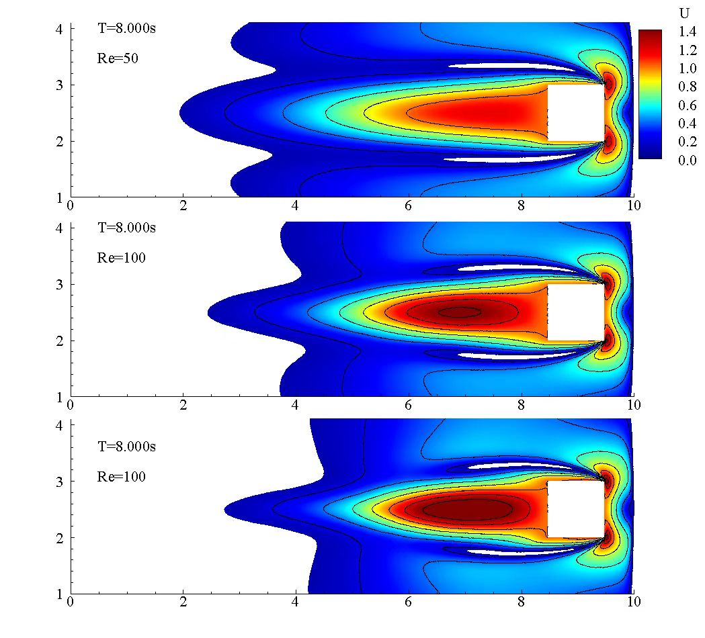
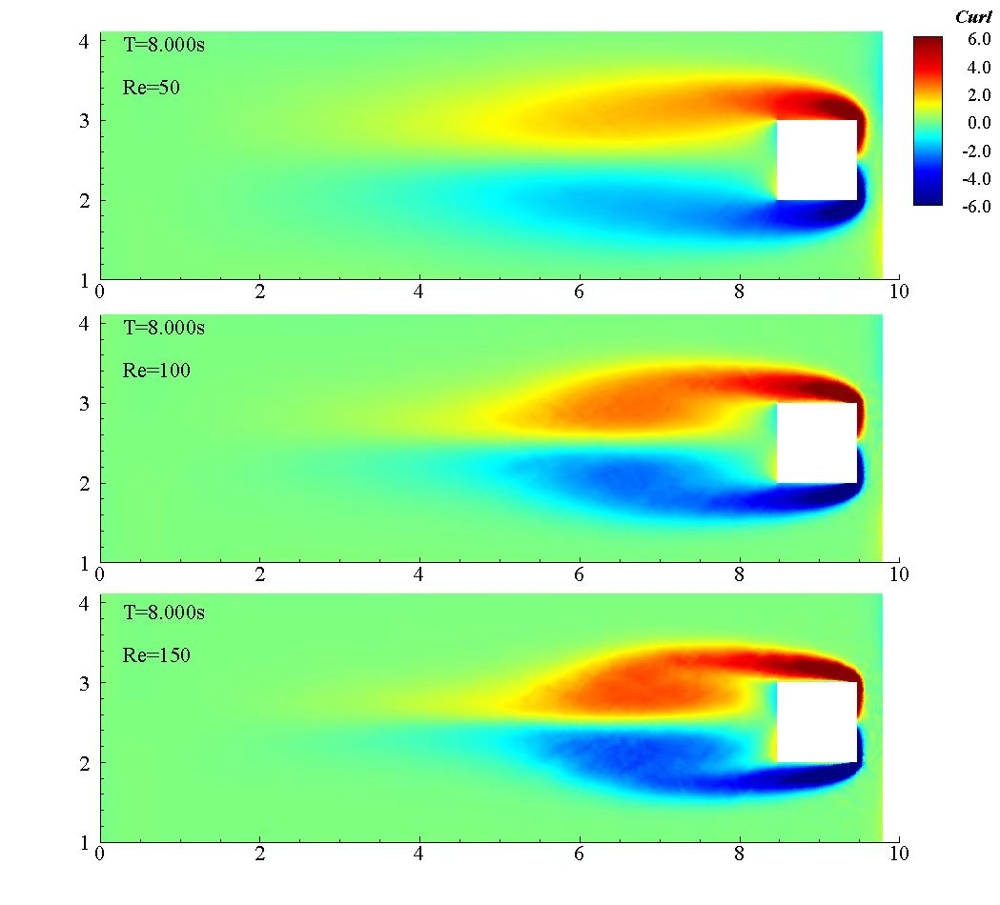

# SPH (Smooth-particle Hydrodynamic)

## 1. 📘 About This Code
These Fortran codes were developed during my master's study. The solver is based on the Smoothed Particle Hydrodynamics (SPH) method for solving the **weakly compressible Navier–Stokes equations**.

### 1.1 ✨ Features
- Parallelization:
  - MPI (Message Passing Interface)
  - OpenMP (shared memory parallelism)

- Supports various boundary conditions:

  - Non-reflecting boundary condition

  - Wave generation

  - Wave damping zone

  - Periodic boundaries

  - Inlet/outlet boundaries

  - No-slip and free-slip wall boundaries

- Output formats:

  - Tecplot (Binary / ASCII)

  - ParaView (VTK)

### 1.2 🎯 Purpose
This code is intended as a learning tool for students and researchers interested in SPH methods.
Feel free to explore, modify, and learn from it.

Hope it helps you in your SPH journey!

## 2. Example of Simulation Results

### 2.1 Moving box inside a rectangular box
#### 2.1.1 Gif

- Re = 50


- Re = 100


- Re = 150


#### 2.1.2 Contours
- Contour of velocity in various Re = 50, 100 and 150.




<!-- 


- Contour of curl in various Re = 50, 100 and 150.
 
-->

### 2.2 Flow past a cylinder

<video width="640" height="360" controls>
  <source src="https://github.com/mini-walker/SPH-2D/issues/1#issue-3215628130.mp4" type="video/mp4">
  Your browser does not support the video tag.
</video>

### 2.3 Flow past a square


<!-- 
<video width="640" height="360" controls>
  <source src="Example_of_Results/Flow-past-a-box.mp4" type="video/mp4">
  Your browser does not support the video tag.
</video> -->

## 3. Publication and Citation


## 3.1 📄 Publication

Followings are our publications:

- Jiang, H., Chen, Y., Zheng, X., **Jin, S.**, & Ma, Q. (2020). A Study on Stable Regularized Moving Least‐Squares Interpolation and Coupled with SPH Method. Mathematical Problems in Engineering, 2020(1), 9042615. [[Link](https://onlinelibrary.wiley.com/doi/full/10.1155/2020/9042615)]

- **Jin, S. Q.**, Zheng, X., Duan, W. Y., & Niu, K. N. (2015). A new boundary treatment method for smoothed particle hydrodynamics. Procedia Engineering, 126, 655-659. [[Link](https://www.sciencedirect.com/science/article/pii/S1877705815035857)]


### 3.2 📚 Citation (BibTeX)


```bibtex
@article{jin2015new,
  title={A new boundary treatment method for smoothed particle hydrodynamics},
  author={Jin, Shan-Qin and Zheng, Xing and Duan, Wen-Yang and Niu, Kang-Ning},
  journal={Procedia Engineering},
  volume={126},
  pages={655--659},
  year={2015},
  publisher={Elsevier}
}

@article{jiang2020study,
  title={A Study on Stable Regularized Moving Least-Squares Interpolation and Coupled with SPH Method},
  author={Jiang, Hua and Chen, Yunsai and Zheng, Xing and Jin, Shanqin and Ma, Qingwei},
  journal={Mathematical Problems in Engineering},
  volume={2020},
  number={1},
  pages={9042615},
  year={2020},
  publisher={Wiley Online Library}
}
```
